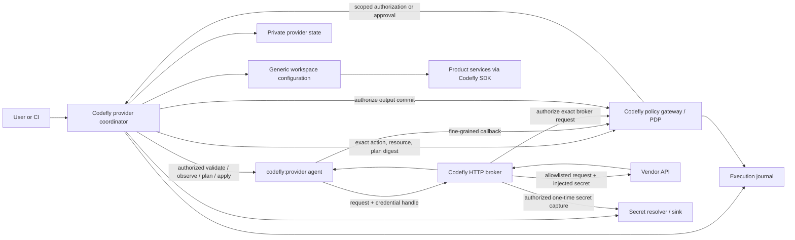

# Codefly external provider plugins

Status: proposed design and implementation roadmap

Research date: 2026-07-30

Initial reference providers: Stripe, Sentry, Resend

## Executive decision

Codefly should add a first-class external provider plugin type:

```yaml
kind: codefly:provider
```

An external provider plugin connects a Codefly environment to a managed SaaS
API. It can validate vendor-specific inputs, inspect remote state, calculate a
reviewable plan, perform explicitly approved remote mutations, diagnose drift,
and project the resulting values into Codefly's existing generic workspace
configurations.

The initial implementation should be designed against three providers before
the protocol is frozen:

1. **Stripe first**: credential validation, sandbox/live separation,
   idempotent mutations, local forwarding, a remotely managed webhook, and a
   one-time signing secret.
2. **Sentry second**: mostly read/discover/project behavior, no inbound
   webhook, a browser-exposable DSN, regional/self-hosted API origins, and
   distinct setup/build credentials. This prevents a webhook-shaped
   abstraction.
3. **Resend third**: verified-domain prerequisites, a second webhook lifecycle,
   a different local forwarder, rate limits, and a sharp split between
   full-access management credentials and sending-only runtime credentials.

The provider plugin must not become a service in the application graph. It has
no user workload, endpoint, image, readiness loop, or deployable process.
Codefly starts the provider agent only while operating on the external
integration.

The application boundary does not change:

- Accounts and the frontend continue to consume `billing`, `email`,
  `error-tracking`, and other generic Codefly configurations.
- Product code never imports a provider agent or asks whether Stripe, Resend,
  or Sentry was selected.
- The provider plugin translates vendor-specific API state into an existing
  generic configuration contract.
- Codefly, not the provider, owns environment selection, service endpoint
  resolution, secret resolution and persistence, state locking, plan approval,
  execution receipts, and configuration injection.

This is deliberately smaller than Terraform or Pulumi. Codefly is not adding a
general infrastructure language or a universal resource graph. The first goal
is a safe, reusable lifecycle for application-facing SaaS integrations that
today require bespoke setup scripts and dashboard instructions.

### Adversarial-review disposition and P0 decisions

The independent adversarial review in
`docs/provider-plugins-adversarial-review.md` approved the direction with
required changes. The following decisions are normative and supersede any
contradictory wording later in this document:

1. **Third-party publication is an intended capability.** Stripe, Sentry, and
   Resend are first-party reference providers, but the v0 trust boundary must
   be safe for independently authored provider agents. Provider binaries are
   untrusted by design; the sandbox, broker, credential handles, permission
   composition, and response filtering are foundation work, not later
   hardening.
2. **Origin admission is host-owned and two-part.** The manifest declares
   default origins and bounded origin patterns. A binding may request a
   concrete origin, but the host resolves and admits it explicitly, displays
   it in the plan, and binds it into the plan digest and credential handle.
   Private, loopback, link-local, and otherwise non-public destinations are
   rejected unless a separately governed self-hosted-origin permission
   explicitly admits them.
3. **Raw secrets never enter a provider process in v0.** There is no
   manifest-gated raw-secret escape hatch. Existing credentials move
   host-to-host; provider API responses are schema-filtered by the broker
   before the provider sees them.
4. **Projection is one explicit host action.** `PROJECT_OUTPUT` is an ordered
   plan action executed by the host. For observe-only providers it may be the
   only apply action. For managed providers it runs after required remote
   effects and durable secret captures. There is no separate unplanned
   post-Apply projection step.
5. **One-time secret persistence is durable at Put.** A successfully captured
   write-once value is never rolled back because a later configuration action
   fails. The sink contract distinguishes durable capture from aborting an
   unused prepared target.
6. **Response policy applies to reads and writes and fails closed.** Broker
   response schemas use an allowlist with explicit `forward`, `suppress`, and
   `capture` dispositions, including bounded array selectors. Unknown fields
   are dropped. A required capture or required safe field that cannot be
   parsed is not forwarded as raw bytes.
7. **Apply is host-driven per action.** Provider-to-host request descriptors,
   broker responses, checkpoints, capture results, and output commits are part
   of the same versioned protocol as the host-to-provider RPCs. The host
   authorizes and executes each exact plan action and acknowledges its durable
   checkpoint before the provider may request the next external effect.

The readiness gates are also explicit:

- **Gate A — local dogfood:** first-party and third-party-shaped providers run
  under the hardened provider launch path with local state and an owner-only
  ignored-file sink.
- **Gate B — production observe:** digest-verified provider artifacts,
  non-expired principals, Ed25519 scoped authorization without fallback,
  fail-closed PDP, read-only broker policy, and retained receipts are
  mandatory; no remote mutation is expressible.
- **Gate C — production mutation:** remote encrypted shared state and locking,
  a qualified writable production secret sink, digest locks, backup/restore,
  recovery, rotation, and multi-user concurrency are mandatory.

The local sink is not evidence that production mutation is ready. Production
mutation remains disabled until Gate C selects and qualifies a real managed
sink against the durable-capture semantics.

## Why this is the right time

The SaaS starter now contains independent setup scripts for WorkOS, Stripe,
Resend, PostHog, Sentry, OpenTelemetry, and Turnstile. The scripts established
the real common lifecycle:

1. resolve the Codefly workspace and environment;
2. collect public inputs and secrets without putting secrets in command
   arguments;
3. validate local configuration;
4. resolve Codefly-owned callback endpoints;
5. make bounded read-only provider requests;
6. optionally create provider-side resources;
7. capture one-time outputs such as webhook signing secrets;
8. write generic workspace configuration safely;
9. run `codefly doctor`;
10. report exact remaining operator-owned actions.

That repetition is now mature enough to extract. Extracting it earlier would
have produced a WorkOS- or Stripe-shaped interface. Waiting longer would copy
the same security-sensitive shell lifecycle into every starter.

Research also found concrete drift between scripts and current vendor
capabilities. For example, current Resend documentation says webhook create,
retrieve, or list calls may return the signing secret, while the list API
example omits it. The current setup script assumes an existing secret cannot be
retrieved. A versioned provider plugin with live acceptance tests can isolate
and continuously qualify that changing behavior without rewriting every
starter.

## Goals

The provider system must:

1. add `codefly:provider` as an installable, versioned agent kind;
2. support more than one independently configured instance of a vendor;
3. keep vendor concerns outside service code and generic configurations;
4. expose a deterministic, inspectable schema for setup inputs and outputs;
5. distinguish offline validation, read-only remote observation, planning, and
   mutation;
6. produce a stable plan digest that an apply must consume;
7. make retries idempotent and classify uncertain outcomes honestly;
8. support existing/adopted resources as well as Codefly-managed resources;
9. retain remote resources by default when disconnecting a provider;
10. separate management, runtime, build, webhook, and browser credential roles;
11. keep raw secret values out of workspace YAML, command arguments, logs,
    plans, state, receipts, and diagnostics;
12. project output through Codefly's existing configuration loader and SDK
    injection;
13. resolve callback URLs through Codefly's endpoint and ingress model rather
    than accepting copied local ports;
14. reuse Codefly agent distribution, authenticated UDS transport, sandbox,
    PDP, structured failures, execution receipts, state durability, and doctor;
15. provide deterministic replay tests plus explicit live acceptance suites;
16. migrate existing setup scripts into thin compatibility shims;
17. remain usable interactively by a founder and non-interactively by CI.

## Non-goals for the first release

The first release will not:

- replace Terraform, Pulumi, Crossplane, or a cloud control plane;
- expose arbitrary provider resources to application code;
- run a continuous reconciliation controller;
- create Stripe products or prices without an explicit pricing specification;
- infer destructive intent from removing configuration;
- delete provider accounts, domains, organizations, or projects by default;
- build a new secret store;
- persist raw secrets in provider state;
- install or invoke vendor CLIs from inside a provider agent;
- own tunnels, DNS, or long-running local webhook forwarders;
- let providers write directly to the workspace;
- let a provider choose ports, hosts, service dependencies, or deployment
  topology;
- require every external integration to support remote mutations;
- make production mutations available before production secret and state
  safety gates are complete.

## Terminology

Several existing Codefly concepts use the word provider. The following terms
are normative:

| Term | Meaning |
| --- | --- |
| external provider agent | A `codefly:provider` plugin binary, such as `codefly.dev/stripe:0.1.0` |
| provider binding | One environment-scoped instance that selects an agent, inputs, output configuration, management policy, and desired remote resources |
| provider resource | A remote object observed or managed by the provider agent, such as a Stripe webhook endpoint |
| provider input configuration | Vendor-specific values and credential references consumed by the provider agent |
| configuration projection | Generic Codefly configuration values emitted for application services, such as `billing` |
| secret provider | The existing environment backend that resolves references such as `op://...`; it is not an external provider agent |
| runtime credential | A credential required by the product while it runs |
| management credential | A credential used only to inspect or provision provider-side resources |
| build credential | A credential used during packaging or release publication, such as a Sentry source-map token |
| owned resource | A remote resource created by this exact Codefly binding and recorded in its state |
| adopted resource | A pre-existing remote resource explicitly imported into this binding |
| observed resource | A read-only dependency that Codefly never manages |

User-facing documentation may shorten "external provider agent" to "provider
plugin" when the meaning is unambiguous.

## Research and precedent

### Terraform

Terraform providers are separate plugin processes with provider-level schemas,
configuration, resources, data sources, validation, planning, apply, state
upgrade, import, and acceptance tests. The useful lessons are:

- schemas must be machine-readable and versioned;
- provider-level configuration should be separate from per-resource desired
  state;
- offline validation must not require credentials or network access;
- remote observation, plan, and apply are distinct phases;
- import is an explicit operation binding one remote identity to one managed
  address;
- state schema upgrades are part of the provider contract;
- acceptance tests should exercise real plan/apply/refresh/destroy behavior.

Codefly should not copy Terraform's full resource language or store raw secret
values in general-purpose state.

### Pulumi

Pulumi's provider protocol reinforces `Check`, `Diff`, `Create`, `Read`,
`Update`, and `Delete`, with a provider executable called over gRPC. Its plan
responses explicitly identify changed fields and replacements. The useful
lessons are:

- remote identity must be stable and provider-defined;
- replacements and delete-before-replace behavior must be explicit;
- provider executables should be independently installable and versioned;
- a read operation is essential for refresh and import;
- provider configuration and resource operations need a strict protocol.

Codefly should not require a generated language SDK for every provider. Product
services consume generic Codefly configurations, not provider resource types.

### Crossplane

Crossplane providers install APIs and continuously reconcile external
resources. It has strong package revision, health, dependency, digest, and
deletion-protection concepts. The useful lessons are:

- provider installation health is distinct from remote resource health;
- package revisions and compatibility must be visible;
- removing a provider before its resources can orphan remote state;
- deletion protection should be the default when resources remain;
- immutable package digests improve repeatability.

Codefly's first provider release is command-driven, not a continuously running
controller. A later drift monitor may schedule read-only observation, but
continuous reconciliation must not be implied by v1.

### Vendor APIs

The three initial vendors expose enough variation to shape a neutral contract:

| Concern | Stripe | Sentry | Resend |
| --- | --- | --- | --- |
| primary product capability | billing | error tracking | transactional email |
| basic setup behavior | validate account; configure runtime key | discover project and client DSN | validate account/domain/sender |
| managed v1 resource | webhook endpoint | none required; optional project later | webhook endpoint |
| inbound callback | required for subscription lifecycle | none for basic SDK ingestion | required for delivery lifecycle |
| local callback story | Stripe CLI forwards to Codefly loopback | not applicable | Resend CLI can expose and forward to local |
| one-time or sensitive remote output | webhook signing secret is returned at creation | public DSN is discoverable; tokens remain sensitive | webhook signing secret behavior varies by endpoint/docs and must be capability-tested |
| environment safety | sandbox/test versus live is critical | environment tag is logical, not an account mode | no Stripe-like test/live key prefix |
| management credential | webhook/account access | project read/write depending operation | full-access key for resource management |
| runtime credential | restricted secret key for approved billing calls | public DSN; no management token needed at runtime | sending-only key, preferably domain-restricted |
| build credential | none in initial scope | `org:ci` token for releases/source maps | none in initial scope |
| remote API version | explicit Stripe API version should be pinned | API is currently v0 and may be regional/self-hosted | current docs say no explicit version header yet |
| important rate-limit behavior | retry/idempotency semantics and provider headers | per caller+endpoint limits and concurrency headers | default team-wide request rate with `429` |

The credential rows are especially important. A generic `api_key` field is
insufficient. The protocol needs named credential purposes and least-privilege
scope descriptions.

## What Codefly already has and should reuse

The provider implementation should be mostly new composition around existing
Codefly primitives, not a parallel platform.

| Existing Codefly capability | Current source | Reuse | Required extension |
| --- | --- | --- | --- |
| agent identity and kinds | `resources/agent.go`, `base/v0/agent.proto` | publisher/name/version identity | centralize inconsistent kind routing with fail-closed defaults, fix existing Toolbox routing, then add `PROVIDER` |
| agent build and local install | CLI `agent build` | source packaging, native/Linux artifacts, SBOM stages | make all build/install/list/version/publish routes kind-aware and install providers under `agents/providers` |
| agent release discovery | agent manager, GitHub/OCI/Nix stores | concrete versions, local-first development, existing store transports | package the provider manifest with the artifact and add digest verification; GitHub auto-download is disabled for providers until verified |
| authenticated plugin transport | agent manager | private UDS, per-spawn bearer, process supervision | mandate UDS for providers; no TCP fallback |
| plugin sandbox and PDP primitives | `policy`, agent manager | permission types, principal binding, ceiling PDP, scoped authorization, callbacks, production-admission validation | new CLI composition, provider capacity ceiling, environment allowlist, per-platform enforcement, and per-request admission |
| structured failures | `base/v0/failure.proto` | neutral error classes, retryability, diagnostics, retry-after | provider diagnostic codes in existing envelopes |
| workspace environments | `resources/environment.go` | environment/profile selection, secret backend, ingress | add provider bindings per environment |
| workspace configuration loader | `configurations` | nested named configs, public/secret values, dependency injection | add versioned generic contracts, richer classification, and a host-owned atomic projection writer |
| secret references | `configurations/secrets.go` | read-only `op://` resolution, per-load cache, redaction | add writable secret-sink contract before managed production secrets |
| configuration redaction | `ConfigurationValue.Secret`, `IsSensitiveKey` | protect logs and summaries | richer output classification before conversion |
| service endpoint allocation | network/runtime manager and `codefly endpoint` | dynamic local ports and endpoint identity | resolve endpoint references for provider requests |
| environment ingress | `Environment.Ingress` | public host declarations for deployment rendering | build a new `(environment, service, endpoint) -> public HTTPS origin` resolver |
| Web toolbox guard fragments | `toolbox-web` | small URL/redirect/timeout/response-cap patterns and tests | build a new trusted host HTTP broker; do not reuse its in-process trust boundary or open-network transport |
| workspace doctor | CLI doctor | local environment/configuration/secret validation and stable report | keep remote checks in a new bounded `provider doctor`; add only static provider checks to workspace doctor |
| execution receipt primitives | `executionreceipt`, CLI execution journal/runtime | signed facts, terminal states including `UNCERTAIN`, bbolt patterns | new provider-operation production and ordinary CLI wiring |
| durable local state patterns | execution journal and update state | private dirs, `0600`, bbolt/fsync, inter-process locks | provider state schema and workspace/environment isolation |
| agent CI build/package stages | `codefly agent ci` | source/build/audit/drift and isolation patterns | new provider leaf-protocol conformance harness and hostile-provider fixtures |
| cassette testing guidance | core testing documentation | design precedent only | new broker recorder, deterministic matcher, fail-closed replay, and sanitizer implementation |

### Reuse boundary

The following behavior belongs in the Codefly host and must not be copied into
Stripe, Sentry, or Resend:

- locating and loading a workspace;
- selecting the environment and configuration profile;
- resolving named public and secret inputs;
- hidden prompting and file-based secret ingestion;
- endpoint and public-ingress resolution;
- credential injection into outbound requests;
- enforcing provider API origin allowlists;
- plan canonicalization and hashing;
- confirmation and policy admission;
- durable state and locking;
- output ownership, safe file writes, and secret sinks;
- execution receipt creation;
- doctor composition and rendering;
- JSON/human output modes;
- plugin install, version, release, and SBOM behavior.

The provider agent owns only vendor semantics:

- input and resource schema;
- normalization and provider-specific validation;
- remote request shapes and response decoding;
- stable remote identity;
- observation and drift comparison;
- provider-specific plan actions;
- idempotency strategy;
- provider error and rate-limit translation;
- output mapping into declared generic configuration contracts;
- provider-specific remediation text.

## Permission architecture: reuse Codefly, do not fork it

Permissions are the load-bearing part of this design. Provider plugins combine
third-party binaries, powerful SaaS credentials, remote mutations, and
one-time secret outputs. They must use Codefly's existing authorization stack
end to end. A provider-specific RBAC implementation, an `is_admin` shortcut,
or authorization performed only inside provider code is a release blocker.

Codefly already has the correct separation:

- **capacity** answers what the provider process can do at the operating-system
  boundary and is enforced by `policy.SandboxPolicy`;
- **authority** answers what the initiating principal is allowed to do and is
  enforced by `policy.PermissionPolicy`, the manifest ceiling, operator
  policy, and the configured PDP;
- **delegation** binds short-lived authority to one action, resource,
  audience, catalog, request, and set of caveats through
  `policy.ScopedAuthorization`;
- **attribution** binds the provider process to the validated human, service,
  or agent principal that initiated the operation;
- **evidence** records the policy decision, approval, operation checkpoints,
  and terminal result through the existing audit and execution-receipt
  systems.

The effective decision is an intersection, never a union:

```text
allow =
    provider manifest declares the action and resource
  ∩ runtime catalog remains below that manifest ceiling
  ∩ initiating principal has a matching role grant
  ∩ operator policy and caveats allow the exact environment/account
  ∩ any required human approval covers the exact plan digest
  ∩ environment binding permits the lifecycle action
  ∩ approved plan contains the exact remote-resource action
  ∩ credential handle permits the exact purpose and request
  ∩ HTTP broker permits the exact origin, method, and path
  ∩ process sandbox permits the underlying system operation
```

A grant at one layer cannot compensate for a denial at another. An
administrator role does not let a provider exceed its manifest. A permissive
manifest does not let a principal exceed their role. An approved `Apply` does
not authorize an unplanned delete. A credential capable of deleting a remote
resource does not itself grant permission to delete it.

### Exact Codefly permission primitives to reuse

| Existing primitive | Provider use |
| --- | --- |
| `policy.Principal` | Attribute every provider operation to the initiating human, service, or agent, including organization and delegation chain |
| `manager.WithPrincipal` | Bind that validated, non-expired principal when the provider agent is spawned |
| `policy.PermissionPolicy` | Declare required and optional actions, typed resource prefixes, human-readable reasons, and risk levels in the packaged manifest |
| `policy.NewCeilingPDP` | Intersect the packaged permission ceiling with role grants; strict provider admission treats an empty manifest as deny-all |
| `policy.GatewayEvaluator` | Evaluate manifest/operator policy and role grants before dispatch and mint an exact scoped authorization |
| `policy.ScopedAuthorization` | Bind principal, action, resource, provider audience, catalog digest, request digest, TTL, maximum uses, and provider caveats |
| `manager.WithScopedAuthSecret` | Reuse the per-spawn v1 verifier locally; use the existing Ed25519 v2 format when host/plugin separation requires public verification |
| `manager.WithPermissionsCallback` | Gate sub-operations against the host PDP without allowing the provider to contact SaaS Starter or impersonate another principal |
| `manager.WithProductionAdmission` | Fail before spawn unless enforcing sandbox, principal, PDP callback, and scoped authorization are all present |
| `policy.PDPDecision.RequireApproval` and escalation | Pause high-risk or critical provider actions for an explicit grantor decision |
| `policy.SaasPDP` | Reuse organization role grants, bounded positive caching, metrics, and fail-closed backend behavior |
| policy observability and execution receipts | Correlate the principal, grantor, scoped authorization ID, plan, remote action, and outcome without recording secrets |

The provider coordinator should compose these primitives. It should not copy
their token formats, caches, callback server, permission matching, escalation,
or metrics.

### Principals and attribution

The provider agent is not the source of authority. It acts on behalf of the
principal that invoked `codefly provider ...`:

- an interactive developer is a human principal;
- CI uses a short-lived service principal;
- Mind or another orchestrator uses an agent principal with an auditable
  delegation chain;
- unattended reconciliation uses a dedicated service principal restricted to
  named environments, bindings, actions, and remote-resource prefixes.

The host validates the principal and binds it with `WithPrincipal`. The
permission callback server uses the spawn-time principal as the authoritative
subject, so a compromised provider cannot claim a different principal ID.
Provider-produced principal fields are ignored for authorization.

No production provider invocation may use `WithoutPrincipal`,
`WithoutSandbox`, `AllowAllPDP`, shadow-only enforcement, or break-glass
implicitly. Those paths remain explicit local/test mechanisms and must be
greppable, surfaced in diagnostics, and rejected by provider production
admission.

### Canonical actions and resources

Use Codefly's existing dotted actions and typed resources. The initial action
vocabulary is deliberately lifecycle-oriented and provider-neutral:

| Action | Typical risk | Meaning |
| --- | --- | --- |
| `provider.validate` | low | Validate declared inputs without remote access |
| `provider.observe` | low | Read the declared remote account/resource subset |
| `provider.plan` | low | Calculate a deterministic local plan |
| `provider.create` | high | Create exactly one planned remote resource |
| `provider.update` | high | Update exactly one planned remote resource |
| `provider.delete` | critical | Delete exactly one owned remote resource |
| `provider.import` | high | Adopt an existing remote resource into Codefly state |
| `provider.disconnect` | medium | Stop projecting configuration while retaining the remote resource |
| `provider.project.public` | low | Write declared non-secret generic outputs |
| `provider.project.secret` | high | Persist a declared secret output through the selected sink |
| `provider.doctor` | low | Run read-only local and remote diagnostics |

`provider.apply` may be a CLI/RPC operation name, but it is not sufficient as
an authority grant. Before applying, the host authorizes every concrete plan
action such as `provider.create` on its exact typed resource. This prevents one
broad Apply grant from becoming ambient CRUD authority.

Resources use a hierarchical form so the existing exact/prefix permission
matching remains useful:

```text
provider:<provider>/<workspace>/<environment>/<binding>/<type>/<remote-id>
configuration:<workspace>/<environment>/<contract>
secret-sink:<workspace>/<environment>/<sink>/<key>
```

Before a resource exists, the final segment is a host-generated prospective
resource ID included in the plan. Unknown remote IDs are never represented by
an unbounded wildcard at apply time. The provider manifest scopes its ceiling
to expanded workspace/environment/binding and resource-type prefixes.
Production admission rejects bare `*` and `provider:<name>/*` mutation grants.
Role grants and operator policies narrow the admitted action to the exact
prospective or observed resource.

If environment and binding placeholders are added to manifest expansion, they
must be resolved by the host before admission and unknown placeholders must
fail loudly, following `policy.MapExpander`. F1 adds
`WORKSPACE_ID`/`ENVIRONMENT`/`BINDING` to the host expansion context.
Provider code never expands permission strings.

### Per-operation authorization

The host must authorize at four moments:

1. **Dispatch**: authorize the requested provider operation and mint a scoped
   token bound to the provider audience, admitted catalog digest, canonical
   request digest, workspace, environment, binding, and account mode.
2. **Plan admission**: evaluate every concrete action/resource pair, including
   output and secret-sink writes. Collect approval for high/critical actions
   without mutating anything.
3. **Broker execution**: before every outbound request, re-check that the
   action/resource is in the approved plan and authorize the exact origin,
   method, path template, credential purpose, and idempotency identity.
4. **Commit**: authorize and atomically commit each public configuration or
   secret-sink projection to its declared resource. The provider agent cannot
   perform this commit.

The scoped authorization should use existing fields directly:

- `AudienceID`: exact publisher/name/version and, for production, artifact
  digest;
- `CatalogDigest`: admitted provider information plus packaged manifest;
- `RequestDigest`: canonical operation or individual plan-action digest;
- `Action` and `Resource`: the exact canonical pair;
- `MaxUses`: one for mutations and secret persistence;
- `TTL`: short enough that a delayed Apply must be re-planned;
- `Caveats`: workspace, environment, binding, observed account ID/mode, plan
  digest, allowed credential purpose, endpoint origin, and approval ID.

An invalid token must be denied. A missing token may use the existing
PDP-callback fallback only for read-only local development; production
admission requires the scoped path. Expiry, changed catalog/request digest,
wrong audience, wrong resource, changed account, or exhausted uses all require
fresh authorization.

### Credential handles are attenuated capabilities

A credential handle is not merely an ID for a secret. The host mints it for
one provider spawn and binds it to:

- initiating principal and organization;
- provider audience and binding;
- operation and approved plan-action digest;
- credential purpose (`MANAGEMENT`, `RUNTIME`, `BUILD`,
  `WEBHOOK_VERIFICATION`, or `BROWSER`);
- allowed origin and authorization/header placement;
- allowed method and path templates;
- expiry and maximum uses.

The HTTP broker verifies these constraints and injects the secret only after
authorization. The provider cannot exchange a management handle for raw
credential material, use a runtime handle to provision resources, select a
different origin, add its own authorization header, or reuse a handle in a
later operation. This is an application of Codefly scoped authorization, not a
second token system.

Runtime/build credentials that must become configuration outputs are moved
host-to-host: resolver to approved secret sink. They do not transit the
provider process. One-time provider outputs are accepted through a
single-purpose broker/host channel, immediately persisted to the approved
sink, and redacted from provider responses, state, logs, plans, receipts, and
cassettes.

### Broker response policy and secret capture

Read responses can contain secrets too. Resend may return webhook signing
secrets from create, retrieve, or list operations, and Sentry client-key
responses contain legacy secret fields beside the public DSN. Therefore
response filtering is mandatory for `Observe`, `Doctor`, recovery, and
mutating requests alike.

The packaged manifest declares a response schema for each admitted
method/path/resource operation. Fields use one of three dispositions:

```text
FORWARD_SAFE
SUPPRESS_REPORT_PRESENCE
CAPTURE_TO_SINK
```

The selector language is versioned and deliberately smaller than general
JSONPath: object-key segments, exact array indices, and bounded array wildcard
segments only. It is not described as RFC 6901 JSON Pointer because wildcard
selection is required for list responses.

Example:

```yaml
response-policies:
  - resource-type: stripe.webhook-endpoint
    operation: provider.create
    method: POST
    path: /v1/webhook_endpoints
    success-statuses: [200]
    content-type: application/json
    fields:
      - selector: /id
        disposition: FORWARD_SAFE
        required: true
      - selector: /secret
        disposition: CAPTURE_TO_SINK
        output: webhook-verification-secret
        purpose: WEBHOOK_VERIFICATION
        required: true

  - resource-type: sentry.client-key
    operation: provider.observe
    method: GET
    path: /api/0/projects/{organization}/{project}/keys/
    success-statuses: [200]
    content-type: application/json
    fields:
      - selector: /*/id
        disposition: FORWARD_SAFE
      - selector: /*/dsn/public
        disposition: FORWARD_SAFE
      - selector: /*/secret
        disposition: SUPPRESS_REPORT_PRESENCE
      - selector: /*/dsn/secret
        disposition: SUPPRESS_REPORT_PRESENCE
```

The runtime request descriptor may select only a subset of the packaged
policy. It cannot add selectors, broaden a path, change a disposition, choose
a sink target, or downgrade a required field.

For every matching response, the broker:

1. owns `Accept-Encoding`, bounds compressed and decompressed bytes, rejects
   duplicate JSON keys, and parses before logging, metrics, diagnostics, or
   cassette recording;
2. validates status and content type;
3. applies the declared selectors to reads and writes;
4. drops every undeclared field rather than forwarding it;
5. reports only presence for suppressed fields;
6. durably persists captured bytes into the pre-authorized deterministic sink
   target, then replaces them with opaque reference, presence, and safe
   fingerprint metadata;
7. re-serializes canonical filtered JSON and returns only those new bytes to
   the provider;
8. sanitizes the same declared fields before cassette persistence;
9. checkpoints every durable capture before another external action.

When a method/path rule matches but parsing, required-field selection,
capture, or durable persistence fails, the broker fails closed and never
forwards the original response. A failure after a possibly successful remote
mutation is `UNCERTAIN`; a failure on a read is a blocked/incomplete
observation. Optional provider behavior such as Resend secret retrieval uses
explicit results such as `CAPTURED`, `ABSENT`, `REDACTED_PRESENT`,
`PRESENT_UNDECLARED`, and `SINK_FAILED`; documentation ambiguity is never
collapsed into a boolean assumption.

For one-time mutation outputs, the host must prepare and permission-check the
sink before sending the request. A successfully persisted capture survives
later state or public-projection failure. Non-JSON response filtering and
providers that inherently require an in-process native SDK remain out of v0
and need a separate security review rather than a raw-body escape hatch.

### Approval and revocation semantics

Manifest risk levels feed the existing escalation system:

- read-only validation/observation/doctor normally remain low risk;
- remote create/update/import and secret persistence are high risk;
- delete, live-account mutation, ownership replacement, or a broader
  credential projection are critical.

An approval binds the principal, grantor, provider audience and artifact
digest, account, environment, binding, plan digest, exact actions/resources,
expiry, and approval ID. Editing the desired binding, changing an endpoint,
refreshing observation, upgrading the provider, changing the secret sink, or
altering any action invalidates approval. `--yes` can suppress an interactive
prompt only where policy already allows; it cannot manufacture authority or
bypass escalation.

Revocation is checked at every brokered sub-operation and output commit rather
than only when the agent is spawned. Codefly's current positive-decision cache
remains bounded and denies are never cached. Long plans must tolerate a grant
being revoked between actions: stop, checkpoint, emit receipts, and return a
partial/denied result without attempting remaining mutations.

### Permission evidence and tests

Every authorization decision should expose safe correlation fields:

- principal and organization IDs;
- delegation chain and grantor ID where applicable;
- provider audience, version, and digest;
- workspace/environment/binding;
- canonical action and redacted resource;
- plan, scoped-authorization, approval, operation, attempt, and receipt IDs;
- allow, deny, require-approval, fail-closed, expiry, or caveat-mismatch
  outcome;
- policy decision path without tokens, credentials, raw provider bodies, or
  secret outputs.

The foundation test suite must prove intersections and negative space, not
only happy-path allow:

- manifest allows + role denies = deny;
- role allows + manifest omits = deny;
- valid role + wrong environment/account caveat = deny;
- stale plan/request/catalog digest = deny;
- wrong provider audience or binding = deny;
- create grant cannot update or delete;
- public projection grant cannot persist a secret;
- management credential handle cannot be used for a runtime projection;
- provider cannot choose a different origin, method, path, or auth header;
- provider cannot impersonate a principal through the callback;
- permission backend failure = fail closed;
- revocation between plan actions halts remaining work;
- approval covers only the exact high/critical actions;
- production admission rejects every missing security layer independently;
- no denied operation changes remote state, local state, configuration, or
  secret sinks.

## Architecture



The provider agent has:

- authenticated loopback/UDS access to the Codefly host;
- no direct workspace write access;
- no direct secret-store access;
- no direct product-service access;
- no external network by default;
- only the provider input subset and credential handles required for the
  current operation.

The Codefly HTTP broker has:

- manifest-declared origin defaults/patterns plus host admission of the exact
  binding origin;
- bounded methods, request/response sizes, and timeouts;
- no redirects on credentialed requests;
- credential injection by opaque handle;
- safe provider request IDs and rate-limit metadata;
- no generic logging of headers or bodies;
- a cassette recorder/replayer for tests.

This is safer than giving every third-party provider binary `network: open`
plus raw bearer tokens. The existing Web toolbox contributes test cases and a
few small guard patterns only. The trusted host broker, credential injection,
request derivation, response filtering/capture, and cassette system are new.

For APIs that cannot operate through the broker, a future provider may request
reviewed native egress. Native egress is not part of the initial production
contract and must never be silently enabled.

## Resource and binding model

### Agent identity

The agent's `agent.codefly.yaml` uses the new kind:

```yaml
publisher: codefly.dev
kind: codefly:provider
name: stripe
version: 0.1.0
```

Provider agents install under:

```text
~/.codefly/agents/providers/<publisher>/<name>__<version>
```

The same local, Nix, OCI, and GitHub resolution order applies. Production
bindings must pin a concrete semantic version. A later agent lock file should
also pin the artifact digest.

### Provider manifest

Each provider source package includes a `provider.codefly.yaml`. It is the
reviewable maximum capability declaration and is packaged with the release:

```yaml
name: stripe
version: 0.1.0
description: Configure and manage Stripe billing integration resources.
agent:
  kind: codefly:provider
  publisher: codefly.dev
  name: stripe
  version: 0.1.0

protocol-version: 1

api-origin-rules:
  - name: primary
    defaults:
      - https://api.stripe.com
    host-patterns:
      - api.stripe.com
    schemes:
      - https
    private-network: deny
    binding-override: explicit-admission

permissions:
  required:
    - action: provider.observe
      resource: provider:stripe/${WORKSPACE_ID}/${ENVIRONMENT}/${BINDING}/stripe.*
      reason: Validate the selected Stripe account and inspect billing webhook drift.
  optional:
    - action: provider.create
      resource: provider:stripe/${WORKSPACE_ID}/${ENVIRONMENT}/${BINDING}/stripe.webhook-endpoint/*
      reason: Create the explicitly planned billing webhook.
    - action: provider.update
      resource: provider:stripe/${WORKSPACE_ID}/${ENVIRONMENT}/${BINDING}/stripe.webhook-endpoint/*
      reason: Reconcile the explicitly planned URL and event set.
    - action: provider.delete
      resource: provider:stripe/${WORKSPACE_ID}/${ENVIRONMENT}/${BINDING}/stripe.webhook-endpoint/*
      reason: Delete only an owned endpoint through an explicit destroy plan.
  risk_levels:
    provider.create: high
    provider.update: high
    provider.delete: critical

sandbox:
  read_paths: []
  write_paths: []
  network: loopback

projections:
  - contract: codefly.dev/configuration/billing
    version: 1

resource-types:
  - stripe.account
  - stripe.webhook-endpoint
```

The running provider's advertised catalog must be a subset of the packaged
manifest. A binary/manifest mismatch fails before credentials are supplied.
This mirrors toolbox manifest-ceiling validation.

An origin rule is a ceiling, not permission to contact every matching host.
The host normalizes the binding's requested API base, rejects URL user info,
queries, and fragments, matches the scheme/host/port against the rule, and
places the exact concrete origin in the plan. Operator-supplied origins require
explicit admission. The broker disables environment proxies, resolves once
and pins the peer for the operation, and rejects loopback, link-local,
RFC1918, ULA, CGNAT, and other private destinations unless the manifest and an
explicit high-risk self-hosted-origin grant both permit that class. The exact
origin and resolved policy are bound into the credential handle and plan
digest.

### Environment provider binding

Bindings belong to one Codefly environment. They must not live in service
configuration because several services consume the same projected capability.

Proposed YAML:

```yaml
environments:
  - name: local-dogfood
    provider-bindings:
      billing:
        agent:
          kind: codefly:provider
          publisher: codefly.dev
          name: stripe
          version: 0.1.0
        input-configuration: providers/stripe
        output-configuration: billing
        output-contract: codefly.dev/configuration/billing@1
        management: managed
        deletion-policy: retain
        spec:
          account-mode: sandbox
          api-version: 2026-02-25.clover
          webhook:
            lifecycle: managed
            callback:
              service: auth-sidecar
              endpoint: rest
              path: /v1/billing/webhook
            exposure: local-forwarded
            events:
              - customer.subscription.created
              - customer.subscription.updated
              - customer.subscription.deleted
              - invoice.paid
              - invoice.payment_succeeded
              - invoice.payment_failed
              - customer.subscription.trial_will_end
```

`provider-bindings` is a map so the binding name is stable and unique within
the environment. Multiple Stripe accounts can be bound with different names.

Normative fields:

| Field | Meaning |
| --- | --- |
| agent | exact provider agent identity |
| input-configuration | named Codefly workspace configuration containing provider inputs and secret references |
| output-configuration | generic Codefly configuration name written by the host |
| output-contract | versioned schema identifier for the projection |
| management | `observe`, `managed`, or `disabled` |
| deletion-policy | `retain` by default; `delete-owned` only with explicit destroy |
| spec | non-secret provider-specific desired state validated by provider schema |

Secrets are forbidden in `spec`. Values classified as credentials must come
from `input-configuration`.

### Management modes

`observe`:

- validates and reads remote state;
- can import or reference existing resources;
- projects configuration;
- cannot create, update, or delete remote objects.

`managed`:

- supports plan/apply for resource types advertised by the provider;
- still requires explicit approval and policy;
- manages only owned or explicitly adopted resources.

`disabled`:

- preserves the declaration and state;
- emits no runtime projection;
- performs no remote requests.

Removing a binding is not equivalent to deleting its remote resources.
`codefly provider disconnect` removes or disables the projection while
retaining remote state. `codefly provider destroy` is a separate planned
operation.

## Configuration and credential model

### Provider inputs

Provider schemas classify each input:

```text
PUBLIC
SENSITIVE
SECRET
CREDENTIAL_HANDLE
```

They also declare purpose:

```text
MANAGEMENT
RUNTIME
BUILD
WEBHOOK_VERIFICATION
BROWSER
```

Example provider input configuration:

```dotenv
STRIPE_API_BASE=https://api.stripe.com
STRIPE_MANAGEMENT_API_KEY=op://dogfood/stripe-management/credential
STRIPE_RUNTIME_API_KEY=op://dogfood/stripe-runtime/credential
```

The host resolves secret references. The provider receives opaque credential
handles for brokered requests, not raw credential values. V0 has no raw-secret
escape hatch. A credential that must be projected moves directly from the
host resolver to the authorized host sink. A transformation that inherently
requires provider code to see raw secret bytes is unsupported in v0 and
requires a separate host-owned primitive or a later security-reviewed
protocol.

No provider command accepts a secret literal flag such as
`--api-key sk_...`. Supported sources are:

- a named Codefly configuration;
- a secret reference;
- an owner-only secret file consumed by the host;
- hidden interactive input;
- an approved CI secret channel.

### Credential separation

The protocol must make least privilege possible even if local dogfood starts
with one shared key.

Stripe:

- management key: account inspection and webhook management;
- runtime key: only the product's approved customer, checkout, portal,
  subscription, and billing operations;
- webhook verification secret: inbound signature verification.

Resend:

- management key: domain and webhook inspection/management;
- runtime key: `sending_access`, ideally restricted to the sending domain;
- webhook verification secret: inbound Svix verification.

Sentry:

- setup key: `project:read` for project and client-key discovery;
- project-management key: only when project creation/update is requested;
- build key: `org:ci` for releases and source maps;
- runtime: public DSN, no management key.

The provider must warn when a powerful management credential is projected as a
runtime credential. Production policy may reject that projection. An explicit
`allow-shared-credential` escape hatch can exist for local dogfood but must be
visible in the plan and receipt.

### Configuration projections

The provider returns typed output values to the host. It never writes files.
Every projection is represented by an ordered `PROJECT_OUTPUT` plan action
whose target contract, keys, classifications, purposes, provenance, current
digest, and expected secret effects are reviewable before approval. The host
executes that action and commits the projection after any prerequisite remote
effects and durable captures. For an observe-only provider, a
`PROJECT_OUTPUT` action may be the only action executed by `codefly provider
apply`; there is no remote mutation and no unplanned post-Apply setup step.

The starter has informal environment-variable conventions, but the versioned
`billing@1`, `email@1`, and `error-tracking@1` schemas do not exist yet. The
provider foundation creates and owns them in Core before provider work can run
in parallel. Each key schema fixes:

- value type and required/optional status;
- public/sensitive/secret classification floor and ceiling;
- credential purpose;
- browser exposability;
- permitted consumer class (`runtime`, `browser`, or `build`);
- provenance requirements and provider-controlled versus host-controlled
  mutability.

The host rejects an output whose declared classification or purpose is outside
the contract. Public outputs are scanned for secret-shaped values before
commit. Because Codefly currently injects configurations as a unit, build-only
credentials use a distinct configuration contract/instance such as
`error-tracking-build`; they cannot share a runtime configuration and rely on
per-key consumer filtering that does not exist.

Each output includes:

- generic contract ID and version;
- configuration name;
- key;
- public value or opaque secret handle/reference;
- classification;
- purpose;
- whether browser exposure is allowed;
- whether the value is stable, computed, or write-once;
- safe fingerprint;
- provenance resource ID.

The host converts outputs to existing `ConfigurationInformation` and
`ConfigurationValue` messages. `SECRET` maps to `secret=true`. Sensitive key
redaction remains defense in depth.

Example Stripe projection:

```dotenv
# billing.env
BILLING_PROVIDER=stripe
STRIPE_API_BASE=https://api.stripe.com
STRIPE_API_VERSION=2026-02-25.clover
```

```dotenv
# billing.secret.env or billing.secret.ref.env
STRIPE_API_KEY=<runtime credential or reference>
STRIPE_WEBHOOK_SECRET=<managed secret or reference>
```

Example Sentry projection:

```dotenv
# error-tracking.env
ERROR_TRACKING_MODE=sentry
NEXT_PUBLIC_ERROR_TRACKING_MODE=sentry
NEXT_PUBLIC_SENTRY_DSN=<public DSN>
NEXT_PUBLIC_SENTRY_ENVIRONMENT=local-dogfood
SENTRY_DSN=<same public DSN for backend SDK>
SENTRY_ENVIRONMENT=local-dogfood
SENTRY_ORG=<organization slug>
SENTRY_PROJECT=<project slug>
```

The backend-safe DSN, organization, project, and environment are also public
keys in `error-tracking@1`. An optional build token is projected separately:

```dotenv
# error-tracking-build.secret.ref.env
SENTRY_AUTH_TOKEN=<build credential reference>
```

The Sentry setup credential is not automatically copied into
`SENTRY_AUTH_TOKEN`. Setup and build are different purposes, and the build
configuration is never injected into browser or runtime services.

### Host-owned projection writer

The existing configuration loader is read-only. Provider support needs a
writer with these invariants:

1. resolve the exact configuration profile from the environment;
2. reject path traversal and symlink targets;
3. stage public and secret outputs in an owner-only temporary directory;
4. verify secret targets are Git-ignored unless using a reference-only file;
5. install public and local secret files with mode `0600`;
6. fsync and atomically rename the complete output set;
7. never overwrite an unowned, differing configuration silently;
8. compare and swap against the output digest included in the approved plan;
9. attach ownership metadata containing binding, provider, plan digest,
   contract version, and output hashes;
10. never store raw secret values in ownership metadata;
11. validate the resulting configuration through the normal loader;
12. restore the prior output set if local validation fails.

The safe idempotency and `--force` checks in `provider-common.sh` should become
the behavioral seed, but the implementation belongs in Go and should replace
generic force with a displayed plan.

### Secret sinks

Secret resolution and secret persistence are different capabilities. Codefly
currently has a read-only 1Password resolver. The v1 local sink may write
ignored owner-only `*.secret.env` files. A managed production operation that
creates a write-once secret must require a writable secret sink.

Proposed sink contract:

```text
Prepare(binding, approved-plan-action, deterministic-address) -> prepared target
PutDurable(name, secret bytes, metadata) -> opaque reference
Lookup(deterministic-address) -> absent | opaque reference
AbortUnused()
```

`PutDurable` returns success only after the sink has durably stored the value.
A successful write-once capture is never rolled back. `AbortUnused` removes
only an empty prepared target. Re-derivable public/output staging may use a
separate transactional commit/rollback interface, but that transaction never
owns a successfully captured write-once secret. Deterministic addressing and
`Lookup` let recovery discover whether a capture survived a lost local
response without reading the secret bytes.

The provider receives none of the storage credentials. The host persists
secret outputs and records only opaque references and fingerprints in provider
state.

Until a production sink exists:

- read-only production providers may run;
- production providers may project already existing secret references;
- production creation of a write-once secret must fail before mutation;
- local dogfood may explicitly select the owner-only file sink.

## Provider protocol

Add:

```text
codefly/services/provider/v0/provider.proto
```

The provider service is a typed leaf capability, like Toolbox, rather than an
extension of Builder or Runtime.

### Agent information

Add:

- `base.v0.Agent.PROVIDER`;
- `resources.ProviderAgent = "codefly:provider"`;
- `agent.v0.Capability.EXTERNAL_PROVIDER`;
- provider routing in agent path, local latest resolution, build, list,
  versions, publish, and CI.

Provider agents use a provider-specific advertisement helper. The existing
`services.Advertisement` assumes Builder and Runtime and should not be
stretched to mean external provider.

### RPC surface

The proposed v1 surface:

| RPC | Network | Mutates remote | Purpose |
| --- | ---: | ---: | --- |
| `GetProviderInformation` | no | no | schemas, contracts, resource types, origins, operations, docs |
| `Validate` | no | no | normalize and validate provider inputs/spec offline |
| `Observe` | read-only | no | authenticate, read remote resources, return canonical observed state |
| `Plan` | no | no | compare desired, prior state, and observation; return canonical actions |
| `ApplyAction` | brokered | action-dependent | execute one exact approved plan action; never an opaque whole-plan loop |
| `Doctor` | read-only | no | provider-specific bounded health and remediation checks |
| `UpgradeState` | no | no | migrate provider-owned state between schema versions |

The same versioned protocol unit also defines the provider-to-host
`ProviderHost` callbacks:

| Callback | Purpose |
| --- | --- |
| `ExecuteRequest` | submit one typed request descriptor for host derivation, authorization, and broker execution |
| `RecordCheckpoint` | add provider-semantic safe state to the host's already recorded transport checkpoint |
| `ResolveCapture` | receive only opaque capture reference/presence/result metadata |
| `ProposeOutput` | supply safe values/opaque references for keys pre-authorized by the `PROJECT_OUTPUT` action |

The provider cannot call these callbacks outside the current action context.
The host binds the action ID, plan digest, principal, binding, request budget,
and previous checkpoint in the callback session. The broker itself records a
durable pre-send checkpoint and the delivery/capture result; it does not trust
the provider to report whether a request was sent. The host acknowledges the
durable checkpoint before it will admit another external request.

`Plan` is deliberately offline. The host calls `Observe`, then supplies the
canonical observation to `Plan`. This makes plan deterministic and lets tests
exercise planning without pretending a mock API is authoritative.

There is no long-lived `Configure` session. Each request carries a
`ProviderContext` containing:

- provider binding identity;
- workspace/environment identity;
- exact agent and protocol version;
- normalized non-secret inputs;
- credential handles;
- resolved endpoint references;
- prior state;
- operation and attempt IDs;
- deadlines;
- policy constraints.

This keeps provider agents restart-safe and prevents hidden process state from
changing behavior.

### Provider information

`GetProviderInformation` returns:

- identity and protocol versions;
- JSON Schema or equivalent typed schemas for provider inputs and `spec`;
- named credential requirements with purpose and minimum scope;
- output contracts and classifications;
- remote resource type schemas and import identity syntax;
- supported management modes;
- supported operations per resource type;
- API-origin defaults, bounded patterns, and self-hosted-origin capability;
- API/version compatibility;
- whether apply supports idempotency, update, replacement, delete, and import;
- documentation and remediation links;
- state schema version;
- provider-specific diagnostic code catalog.

The host validates this response against the packaged manifest before
supplying configuration or credentials.

### Observation

Observation returns canonical, bounded state:

- provider account identity and safe display name;
- account/environment mode;
- credential validity and effective scopes when observable;
- remote resource identity;
- provider-owned fields relevant to drift;
- remote revision, ETag, or last-updated value when available;
- safe response/request IDs;
- rate-limit status and retry-after;
- whether a resource is present, missing, inaccessible, or ambiguous;
- secret availability only as `present`, `missing`, or fingerprint-known;
- diagnostics and exact remediation.

Observation must not include arbitrary provider response bodies.

### Plan

A plan contains ordered actions:

```text
NOOP
PROJECT_OUTPUT
IMPORT
CREATE
UPDATE
REPLACE
DELETE
MANUAL_ACTION
BLOCKED
```

Each action contains:

- stable resource address;
- remote ID when known;
- ownership (`observed`, `owned`, `adopted`, `unmanaged`);
- before and after safe canonical fields;
- secret effects described without values;
- whether it is mutating or destructive;
- whether replacement is required;
- delete-before-create or create-before-delete ordering;
- provider-specific idempotency support;
- preconditions;
- expected configuration projection changes;
- diagnostics;
- manual action instructions when the API cannot perform the operation.

The host canonicalizes and hashes:

- provider agent identity and artifact digest when available;
- provider protocol and state schema versions;
- binding and normalized desired-state hashes;
- prior-state digest;
- material observed-state digest;
- resolved endpoint identities and origins;
- action list;
- output target and current digest;
- secret-sink identity and capabilities;
- policy inputs relevant to approval.

Changing any of these invalidates approval.

Plans contain no raw secrets. Secret presence and fingerprints are sufficient.
The material observation excludes request IDs, rate-limit counters, retrieval
timestamps, diagnostic ordering, and other volatile metadata. It includes
account identity/mode, complete/incomplete pagination status, relevant remote
IDs/revisions, provider-owned fields, secret presence/reference state, and
every precondition that can change the action. Observation freshness is a
separate bounded precondition checked at apply admission; refreshing a
semantically identical observation must not invalidate approval.

### Apply

The coordinator applies one ordered plan action at a time. Each action
requires:

- the exact approved plan and digest;
- a stable operation ID across transport retries;
- a new attempt ID only for an intentional re-execution;
- non-expired observation and endpoint preconditions;
- a durable pre-send checkpoint containing action, prospective resource ID,
  request identity, and idempotency key where applicable;
- a prepared durable secret target when the action may capture a write-once
  value;
- policy admission for the exact remote, projection, state, or sink action.

The provider must:

- accept only the one action selected by the host;
- use the operation/resource identity as the vendor idempotency key where
  supported;
- recheck provider-side preconditions before unsafe updates;
- stop after each externally visible effect until the host acknowledges its
  transport/capture checkpoint;
- classify retryable and permanent provider errors;
- return partial state on every partial failure;
- never report success when the remote result is unknown.

The host derives the concrete action/resource and authorized request from the
plan and manifest; it never trusts provider-supplied authorization labels.
Before each action it rechecks policy/revocation and compare-and-swaps the
plan's state/output digests while holding the binding lock. A denial or stale
precondition stops later actions.

The host coordinator is the only retry owner. A normal authorization has one
use. A same-attempt retry is permitted only when the host has a durable
pre-send checkpoint, reuses the exact idempotency key and request digest, the
vendor operation is declared idempotent, and policy issues a new scoped
authorization for that identical request. `SENT_OUTCOME_UNKNOWN` on a
non-idempotent operation is never retried blindly.

The host records execution receipts:

```text
provider.apply ADMITTED
provider.apply STARTED
provider.apply SUCCEEDED | FAILED | COMPENSATED | UNCERTAIN
```

Safe receipt resources include provider resource type, a bounded remote
reference, before/after digests, and changed status. Receipts never include
credentials, request/response bodies, webhook secrets, DSNs, email addresses,
or arbitrary vendor errors.

### Partial and uncertain apply

Remote APIs cannot provide a transaction spanning remote mutation, provider
state, secret persistence, and local configuration writes. The design must
model that honestly.

Examples:

- Stripe creates a webhook and the connection drops before the response;
- a webhook is created, but the host fails to persist its one-time secret;
- provider state commits but output projection validation fails;
- cancellation occurs after the provider accepted a mutation.

The host records `UNCERTAIN`, persists every known checkpoint, and refuses an
automatic retry that might duplicate an effect. The next plan observes remote
state and proposes one of:

- converge using the stable remote identity;
- import/adopt a uniquely discoverable resource;
- supply or recover the missing secret;
- replace the resource with explicit approval;
- perform a provider-owned compensating delete when safe and approved;
- complete a manual dashboard action.

Stripe idempotency keys reduce creation ambiguity, but they do not replace
state and observation. A key may expire, and not every endpoint/provider has
equivalent semantics.

### State upgrade

Provider state is versioned independently from the agent version. Before
planning with newer code, the host calls `UpgradeState` for every required
schema step. Upgrades:

- are deterministic and offline;
- cannot retrieve credentials;
- cannot make network calls;
- cannot discard remote IDs, ownership, or secret references silently;
- produce before/after digests and a receipt;
- are backed up before commit.

## Provider state

### Location and durability

Use the execution runtime's workspace-isolation pattern:

```text
~/.codefly/providers/<canonical-workspace-identity>/state.db
```

The directory is `0700`; files are `0600`. Use one bbolt or equivalent
fsync-backed transactional store per canonical workspace, with
environment/binding buckets and a workspace-wide index from
`(provider, remote-resource-type, remote-id)` to the owning address. That index
makes cross-binding ownership uniqueness enforceable. Apply compare-and-swap
and ownership checks execute while holding the relevant inter-process lock.
Do not store provider state inside Git by default.

Canonical workspace identity must resolve symlinks and persist enough safe
identity metadata to diagnose relocation. Moving a workspace must fail with
an exact recovery/import instruction rather than silently creating a new empty
state universe.

Team/production state eventually needs a remote encrypted backend and locking.
Until then, mutating production provider operations remain gated.

### State contents

Provider state may contain:

- schema version;
- provider agent identity and prior artifact digest;
- workspace, environment, binding, and output contract identity;
- normalized non-secret desired-state digest;
- remote resource type, stable ID, ownership, and import origin;
- canonical observed fields required for drift;
- last observation time and digest;
- safe request IDs and vendor revision metadata;
- output ownership and file digests;
- secret sink references and safe fingerprints;
- operation, attempt, plan, and receipt IDs;
- pending/partial/uncertain checkpoints.

Provider state must not contain:

- API keys, bearer tokens, webhook secrets, private DSNs, session cookies, or
  secret file contents;
- full provider request or response bodies;
- customer/user data;
- email message content or recipient addresses;
- unbounded error strings.

### Ownership

State distinguishes:

- **owned**: created by this binding;
- **adopted**: explicitly imported by remote ID;
- **observed**: referenced but never managed;
- **unmanaged conflict**: discovered by matching fields but not safe to adopt.

Matching a URL, name, or email address is not sufficient for automatic
adoption. Import requires an explicit remote identity and a plan. One remote
object cannot be bound to multiple local addresses in the same state backend.

### Deletion

The default `deletion-policy` is `retain`.

`codefly provider disconnect`:

- removes or disables the output projection;
- retains provider state and all remote resources;
- reports what remains.

`codefly provider destroy`:

- observes current remote state;
- creates a destructive plan naming exact owned/adopted resources;
- refuses ambiguous or unmanaged resources;
- requires explicit approval and policy;
- deletes only resources allowed by `delete-owned`;
- persists terminal state and receipts.

Deleting the agent package while active bindings or resources remain should be
blocked or loudly diagnosed, following Crossplane's provider-deletion
protection lesson.

## Endpoint, ingress, and local forwarding

Provider specs refer to Codefly endpoint identity, never a URL copied from a
previous run:

```yaml
callback:
  service: auth-sidecar
  endpoint: rest
  path: /v1/billing/webhook
```

The host resolves:

- a loopback runtime origin for local browser and CLI forwarding;
- a public HTTPS origin from environment ingress/deployment when a remote
  provider must call back;
- the final path after validating it is relative and owned by the target
  service.

The provider receives both the semantic endpoint reference and the resolved
origin required for the current operation. It never invokes `codefly endpoint`
or persists a generated local port.

The public resolver is new foundation work:

```text
(environment, service, endpoint) -> admitted public HTTPS origin
```

`Environment.Ingress` currently feeds deployment rendering; it is not already
an operational callback resolver. Plan records the semantic endpoint and the
resolved origin. Apply re-resolves under the binding lock; a changed origin
invalidates the plan before any request is sent.

Callback exposure modes:

`local-direct`:

- provider/browser can call loopback directly, as with a WorkOS browser
  redirect;
- no remote public webhook provisioning.

`local-forwarded`:

- a vendor CLI or an explicit companion forwards remote events to Codefly
  loopback;
- the provider configures the returned signing secret but does not own the
  long-running process.

`public`:

- Codefly resolves a public HTTPS ingress;
- the provider may manage the remote webhook.

`existing`:

- operator supplies an existing remote endpoint ID and secret reference;
- provider observes it and projects configuration without taking ownership
  unless explicitly imported.

Stripe and Resend currently supply vendor CLI forwarding. Long-running
forwarders are not provider resources. A future `Develop` capability may
return a Codefly companion specification, but v1 reports the exact command and
keeps lifecycle ownership separate.

## Security model

### Threat model

Assume:

- a provider binary may be buggy or compromised;
- provider API responses may be malicious or unexpectedly large;
- the local workspace may contain symlinks or malicious paths;
- credentials may be broader than requested;
- an API call may succeed even when the response is lost;
- users may accidentally point local dogfood at production;
- plans may become stale;
- a secret may be returned only once;
- provider docs and response shapes may change.

### Required controls

1. **Manifest ceiling**: the packaged manifest declares maximum origins,
   actions, resource types, outputs, and credential purposes.
2. **Catalog match**: runtime advertisement must be a subset of the manifest.
3. **Pinned agent**: production uses exact versions and, before general
   availability, artifact digests.
4. **Authenticated UDS**: reuse per-spawn agent tokens and private sockets.
5. **Hardened provider launch**: mandatory UDS, a host-owned capacity ceiling,
   an environment allowlist, no direct external network, no workspace or
   secret-store visibility, and verified per-platform enforcement.
6. **HTTP broker**: admitted exact origins, no credentialed redirects,
   method/path/request policy, size/time bounds, credential injection,
   allowlisted response filtering, and no body logging.
7. **Secret minimization**: resolve only the named credential required for one
   operation.
8. **Purpose separation**: management credentials are not runtime outputs by
   default.
9. **Read-only plan boundary**: Validate, Observe, Plan, Doctor, and
   UpgradeState cannot mutate remote state.
10. **Plan digest**: apply can execute only the exact reviewed plan.
11. **Freshness**: apply rejects stale observations and changed output/state
    digests.
12. **Policy admission**: every mutation is authorized against exact action
    and remote resource.
13. **Live guard**: local environments cannot mutate a live/production account
    without a separate break-glass policy.
14. **Safe output transaction**: provider cannot write arbitrary files.
15. **No raw secret state**: secret sink references only.
16. **Signed receipts**: record admitted, started, and terminal outcomes.
17. **Uncertain outcomes**: never auto-retry ambiguous effects.
18. **Deletion protection**: retain by default; explicit destroy only.
19. **Bounded diagnostics**: no raw HTTP bodies or provider exceptions.
20. **Conformance and live acceptance**: qualify actual vendor behavior.

### Provider launch capacity

The current generic agent sandbox is reusable plumbing, not proof of the
provider threat model. At review time:

- the macOS profile permits reads by default and therefore does not prevent a
  provider from reading the workspace or `~/.codefly`;
- the agent manager inherits `os.Environ()`, which can expose operator
  credentials, proxy configuration, and scoped-auth signing material;
- production admission verifies that a sandbox exists but does not impose a
  provider-kind maximum, so a manifest can request `network: open`;
- Linux isolation needs explicit environment clearing and PID/IPC/UTS
  isolation qualification;
- TCP-loopback fallback conflicts with network isolation and is unnecessary
  for providers.

Gate A therefore requires a distinct provider launch profile:

- start the child environment from an empty map and add only protocol,
  locale, bounded temporary-directory, and public verification values;
- never inherit `OP_*`, proxy variables, `*_KEY`, `*_SECRET`, arbitrary
  `CODEFLY_*`, or the HMAC scoped-authorization signing secret;
- use the existing Ed25519 scoped-authorization format so the provider receives
  only a public verification key;
- require authenticated owner-only UDS and reject TCP fallback;
- impose a non-overridable host ceiling of external-network deny, no workspace
  writes, no arbitrary read paths, and only the per-spawn sockets/directories
  required by the protocol;
- expose only the provider binary and required runtime libraries, not shells,
  vendor CLIs, secret-resolver executables, or arbitrary subprocess tools;
- prove direct-dial, workspace/secret reads, writes, environment inheritance,
  subprocess, proxy, and cross-provider socket/state attacks with hostile
  fixtures on Linux and macOS.

If a supported platform cannot enforce and test that profile, third-party
provider execution is unavailable on that platform. Documentation must not
claim hostile-binary isolation from the current generic sandbox alone.

### HTTP broker requirements

The Web toolbox supplies a few useful URL, redirect, timeout, and response-cap
test patterns, but its checks execute inside a process with open network and
do not constitute a trusted broker. The provider broker is new
security-critical host code. It must include:

- provider/binding identity on every request;
- operation action (`observe`, `create`, `update`, `delete`);
- host-derived action, exact resource, remote ID, method, path, query/body
  shape, and request budget from the approved plan and admitted manifest;
- manifest-default plus binding-admitted exact origin policy;
- explicit proxy disablement, resolve-once peer pinning, and private-address
  guards;
- opaque credential-handle injection;
- a caller-header allowlist; the host exclusively owns authorization, cookie,
  host, content-length, idempotency, and accept-encoding behavior;
- request schemas and allowlisted response-field dispositions;
- smaller default body caps for provider APIs;
- safe request ID extraction;
- `Retry-After` and provider rate-limit normalization;
- canonical cassette recording with secret-field sanitization;
- request idempotency-key injection where declared;
- no redirects for credentialed requests;
- explicit delivery status: `NOT_SENT`, `SENT_OUTCOME_UNKNOWN`, or
  `RESPONSE_RECEIVED`;
- cursor/page completeness so incomplete observation can never authorize
  creation or deletion.

The provider should describe requests; the host should enforce transport
policy and safe response shape. Provider-specific signature algorithms and
semantics for the filtered canonical response remain in the provider agent.
The host coordinator is the only retry owner. The broker never retries, and
the provider only classifies the response and declares whether a same-key
retry is meaningful.

### Live-mode policy

Stripe sandbox/test keys are safe for local dogfood; live keys are not.
The Stripe Account object does not expose `livemode`, and the provider sees
only a handle. Therefore the host classifies `sk_`/`rk_` test versus live at
credential-resolution time, binds that classification into the handle and
plan, and cross-checks `livemode` on brokered resource responses where Stripe
returns it. The provider reports the host-attested mode and any mismatch; it
does not inspect the raw key.

Recommended policy:

- `local*` environments may use sandbox/test accounts only;
- production account mutations require a non-local environment, public HTTPS
  endpoint where relevant, writable production secret sink, durable remote
  state, concrete agent version+digest, and explicit approval;
- `--force` cannot bypass these requirements;
- break-glass is a distinct governed operation with a receipt.

Other providers without a test/live key distinction can expose a provider
environment label and organization/account identity. The plan must always show
the observed account so users know where changes will land.

## CLI experience

### Commands

```text
codefly provider list [--env ENV]
codefly provider list [BINDING] [--schema] [--env ENV]
codefly provider setup BINDING --env ENV [--dry-run]
codefly provider plan BINDING --env ENV
    [--validate-only | --refresh-only] [--out PLAN]
codefly provider apply --plan PLAN
codefly provider doctor [BINDING] --env ENV
codefly provider import BINDING RESOURCE_TYPE REMOTE_ID --env ENV
codefly provider disconnect BINDING --env ENV
codefly provider destroy BINDING --env ENV
```

`setup` is the founder-friendly orchestration:

1. load schema;
2. collect missing inputs through safe sources;
3. validate offline;
4. observe remote account/resources;
5. resolve callbacks;
6. display plan and manual actions;
7. apply only after confirmation;
8. write projection;
9. run provider and workspace doctor;
10. print the product command to run.

The plan flags preserve offline validation and read-only refresh for CI and
debugging without separate top-level verbs. `list BINDING` replaces `show`,
`list --schema` replaces `schema`, and first-run `setup` creates the binding
instead of a separate `add`.

Remote provider checks remain behind `codefly provider doctor`. `codefly
doctor workspace` keeps its bounded local/no-agent contract and may report only
static binding, installation, configuration, and state-shape problems. Remote
diagnostic codes use the `external_provider.*` namespace so they cannot collide
with the existing secret-backend `provider_*` codes.

### Human plan example

```text
Provider: billing
Agent:    codefly.dev/stripe:0.1.0
Account:  acct_…7f2 (sandbox)
Output:   billing @ codefly.dev/configuration/billing@1

  ~ stripe.webhook-endpoint.subscription-lifecycle
      url:    https://old.example/v1/billing/webhook
           → https://app.example/v1/billing/webhook
      events: + invoice.payment_failed
      secret: unchanged

  ~ configuration billing
      STRIPE_API_VERSION: 2025-… → 2026-02-25.clover

Mutating actions: 1 update
Destructive actions: 0
Plan digest: sha256:…
```

Secret values are never shown. Browser-exposable values such as a public
Sentry DSN are redacted in generic output unless an explicit `--show-sensitive`
policy permits display.

### Machine output

Every read/plan/doctor command supports deterministic JSON. Apply returns:

- operation/attempt/plan IDs;
- terminal state;
- changed resource counts;
- configuration projection digest;
- receipt IDs;
- safe diagnostics;
- exact next actions.

Machine output never contains secret values.

Stable process exits:

| Exit | Meaning |
| ---: | --- |
| `0` | command succeeded; plan has no diff or apply completed |
| `1` | invalid input, configuration, compatibility, or unclassified failure |
| `2` | valid plan contains a diff and no apply was requested |
| `3` | policy denied |
| `4` | approval is required |
| `5` | partial apply; some effects are known and later actions stopped |
| `6` | uncertain apply; delivery or durable outcome is unknown |
| `7` | plan/state/endpoint observation is stale and must be refreshed |

A local-state plan file is intentionally non-portable: it binds the canonical
workspace identity and exact local state generation and must be applied by a
process that can compare-and-swap that same store. Cross-runner plan/apply is
available only with Gate C's authoritative shared state backend and lock; it
still rechecks state generation, endpoint origin, agent digest, principal,
policy, and approval at apply admission.

### Doctor integration

`codefly doctor workspace --env X` retains its bounded local/no-agent contract
and includes only static external-provider sections:

1. binding schema and agent availability;
2. agent manifest/catalog compatibility;
3. input configuration presence;
4. declared secret resolver/sink availability without resolving values;
5. endpoint and ingress declaration shape;
6. local state/schema/lock health;
7. output projection contract and consumer availability.

`codefly provider doctor [BINDING] --env X` is an explicit, separately bounded
remote command. It may start a provider agent and check authentication/scope,
observed account/environment safety, pagination completeness, remote health,
drift, rate limits, and uncertain-operation remediation. It never mutates.

Stable provider diagnostics should use existing neutral failure codes plus
namespaced diagnostic codes, for example:

```text
external_provider.config.missing
external_provider.auth.rejected
external_provider.auth.scope-insufficient
external_provider.remote.not-found
external_provider.remote.ambiguous
external_provider.drift.detected
external_provider.endpoint.not-public
external_provider.secret-sink.unwritable
external_provider.plan.stale
external_provider.apply.partial
external_provider.apply.uncertain
external_provider.rate-limited
external_provider.schema.incompatible
```

## Reference provider designs

### Stripe v0.1

#### Inputs

- API base, normally `https://api.stripe.com`;
- explicit Stripe API version;
- management credential handle;
- runtime credential handle or explicit shared-credential opt-in;
- existing webhook secret reference for `existing`/forwarded mode;
- account mode policy;
- endpoint reference and exposure;
- event set.

#### Observed resources

`stripe.account`:

- account ID;
- sandbox/live mode;
- safe display metadata;
- effective access failures;
- API version compatibility.

`stripe.webhook-endpoint`:

- endpoint ID;
- URL;
- enabled events;
- status;
- livemode;
- API version;
- description and Codefly ownership metadata when supported.

#### Managed resources

`stripe.webhook-endpoint` supports create, update, import, and explicit delete.
The signing secret returned at creation is a write-once secret output. Existing
endpoints are not auto-adopted by URL.

Create/update requests use stable idempotency keys where Stripe supports them.
The provider pins `Stripe-Version`; it must not inherit a changing account
default silently.

#### Local modes

`local-forwarded`:

- Codefly resolves the loopback callback;
- Stripe CLI is run separately with `--forward-to`;
- its signing secret is captured through a safe host input;
- the provider does not create a remote endpoint.

`public`:

- Codefly resolves a public HTTPS callback;
- provider manages the remote endpoint.

#### Projection

`codefly.dev/configuration/billing@1`:

- `BILLING_PROVIDER=stripe`;
- API base and version;
- runtime restricted key/reference;
- webhook secret/reference.

#### Explicit exclusions

V0.1 does not create products, prices, tax configuration, meters, or a
customer portal policy. The starter's plan-to-price mapping is a separate,
reviewed product catalog concern. A later Stripe provider resource can manage
catalog objects only after a versioned billing catalog contract exists.

#### Acceptance

- sandbox key accepted; live key/local environment rejected;
- wrong account and insufficient scope diagnosed;
- create endpoint, observe no drift, update event set, observe convergence;
- repeated apply is a no-op;
- lost-response/idempotency recovery;
- existing same-URL endpoint is an unmanaged conflict;
- import by endpoint ID;
- signing secret persisted only through selected sink;
- local forwarded mode projects the listener secret without remote creation;
- explicit destroy deletes only the owned test endpoint;
- all tests clean up the dedicated Stripe sandbox account.

### Sentry v0.1

Sentry is intentionally the second implementation because it breaks the
assumption that every provider manages an inbound webhook.

#### Inputs

- API base or regional origin;
- organization and project slugs;
- setup credential handle with project-read scope;
- environment tag;
- optional build credential handle with `org:ci`;
- optional existing DSN for consistency validation.

#### Observed resources

`sentry.project`:

- project ID and slug;
- organization identity;
- active state;
- regional origin;
- platform and safe feature metadata.

`sentry.client-key`:

- client key ID;
- active state;
- public DSN;
- safe rate-limit metadata.

#### Managed resources

V0.1 is observe/project only. Optional project creation is a later capability
because it raises team ownership, default alert-rule, project deletion, and
scope decisions. The protocol still proves useful without mutation.

#### Credential separation

- setup token discovers project and DSN and is not projected;
- build token is projected only to the build/release configuration that needs
  it;
- runtime receives a public DSN and environment;
- browser receives only explicitly browser-exposable public DSN fields.

Sentry API keys are legacy; provider schemas prefer scoped auth tokens.

#### Projection

`codefly.dev/configuration/error-tracking@1`:

- server and browser modes;
- public DSN;
- environment;
- organization and project;
- optional build token reference only when selected.

#### Acceptance

- project-read token validates exact organization/project;
- wrong region, project, or scope is diagnosed;
- DSN discovery matches selected project;
- supplied mismatching DSN fails;
- no mutation occurs during setup;
- setup token is absent from runtime output;
- optional build token requires `org:ci` policy;
- controlled browser/backend events appear in the real test project;
- release/environment correlation is verified in a live acceptance tier.

### Resend v0.1

#### Inputs

- API base;
- full-access management credential handle;
- sending-only runtime credential handle or explicit shared-key opt-in;
- verified sender identity;
- webhook callback/exposure;
- event set;
- existing webhook ID/secret reference where applicable.

#### Observed resources

`resend.domain`:

- domain ID/name;
- region;
- verification status;
- DNS readiness without copying full provider payloads.

`resend.webhook`:

- webhook ID;
- endpoint;
- events;
- status;
- signing-secret presence when the API supplies it.

#### Managed resources

`resend.webhook` supports create, update, import, and explicit delete when
qualified by the live API. The implementation must not hard-code the current
script's assumption that an existing signing secret is unrecoverable.

Current official documentation is internally inconsistent: webhook
verification documentation says create/retrieve/list may return the signing
secret, while the list API example does not show it. The provider must:

- treat a returned signing secret as `SECRET`;
- tolerate its absence;
- prove actual behavior in a live acceptance cassette;
- require a supplied secret reference or approved replacement when absent;
- never log a webhook list response.

#### Credential separation

Resend documents `full_access` and `sending_access`. Management of domains and
webhooks needs the former; product email sending should use the latter,
preferably domain-restricted. The provider should support both handles and
warn/reject unsafe sharing according to environment policy.

#### Local modes

Resend's current CLI can register a temporary webhook and forward to a local
server. As with Stripe, the provider reports the exact Codefly callback but
does not own the long-running CLI process in v1.

Remote webhook provisioning requires a public HTTPS callback.

#### Projection

`codefly.dev/configuration/email@1`:

- `EMAIL_PROVIDER=resend`;
- verified sender;
- API base;
- sending-only runtime key/reference;
- webhook secret/reference.

#### Acceptance

- management and sending-only scopes are distinguished;
- unverified sender/domain blocks projection with remediation;
- webhook create/update/observe converges;
- signing-secret present/absent behavior is recorded against the real API;
- rate limit `429` maps to retryable failure and retry-after;
- local forwarding does not leave a permanent endpoint;
- sent, delivered, bounced, complained, duplicated, and out-of-order events
  are exercised against the starter's durable receiver;
- explicit destroy removes only the owned test webhook.

## Testing and conformance

The provider framework follows Codefly's no-mock testing philosophy.

### Test tiers

#### Tier 0: pure contract tests

No network and no fake provider clients:

- schema validation and normalization;
- secret classification;
- manifest/catalog subset checks;
- canonical observation and plan hashing;
- diff, replacement, and ordering rules;
- state encoding and upgrades;
- output contract mapping;
- redaction;
- path/symlink/mode/atomic writer behavior;
- stale plan and concurrent apply locking;
- failure and receipt conversion;
- fuzz tests for provider response decoders using sanitized real payload
  fixtures.

#### Tier 1: recorded real API cassettes

First recording runs against a real dedicated provider account. Subsequent
runs replay the exact sanitized HTTP interaction through the Codefly broker.

Cassettes:

- are replay-only by default;
- require an explicit record flag for real network;
- pass through the identical production broker request and response policy;
- include request method, canonical path/query/body hash, safe headers,
  response status, safe headers, sanitized body, provider/API version, and
  sequence;
- replace credentials, webhook secrets, DSNs, account IDs, emails, domains,
  timestamps, and request IDs with stable typed placeholders where needed;
- fail if a secret-shaped field remains;
- fail if a required response disposition is missing, unknown raw fields
  survive canonical filtering, or replay policy differs from record policy;
- are reviewed and committed;
- never silently fall back to live network.

This tests real vendor shapes without implementing a mock Stripe, Sentry, or
Resend.

#### Tier 2: provider agent conformance

Extend `codefly agent ci` with `provider` conformance:

1. build and package provider agent through Codefly;
2. load it through authenticated UDS;
3. compare manifest and advertised catalog;
4. validate good/bad configuration offline;
5. replay recorded Observe requests through the HTTP broker;
6. calculate golden plans;
7. execute apply against a Codefly-owned normative loopback fixture server
   that implements pagination, 429/retry-after, idempotency, read/write secret
   responses, and fault/lost-response injection;
8. verify output projection and state;
9. verify receipt sequence;
10. rerun plan and require no diff;
11. verify import/disconnect/destroy capabilities exactly as advertised;
12. run standalone with pinned published core dependencies.

F4 also provides a hostile provider binary that attempts:

- undeclared and unplanned actions;
- direct external and loopback dial outside the broker;
- wrong origin/resource/path/body and caller authorization headers;
- principal spoofing;
- inherited environment/proxy/secret access;
- workspace and `~/.codefly` reads/writes;
- secret-resolver/vendor-CLI subprocess execution;
- cross-provider socket/state access.

All must fail without side effects. Sandbox/capacity conformance runs on
Linux/amd64 and macOS/arm64; a platform without a passing hostile suite is not
eligible for provider execution.

#### Tier 3: live acceptance

Explicit opt-in, dedicated sandbox/test accounts, strict cleanup:

- real credential and scope qualification;
- real remote create/read/update/delete when supported;
- idempotency and retry behavior;
- rate limiting;
- provider dashboard/API consistency;
- secret capture and sink;
- import and drift;
- no-op second plan;
- cleanup verification.

Live acceptance must carry a flag analogous to Terraform's explicit acceptance
gate so ordinary unit tests cannot incur remote mutations.

#### Tier 4: SaaS starter dogfood

Run the real Codefly graph and provider:

- WorkOS identity;
- Stripe sandbox checkout, portal, webhook, reconciliation;
- Resend invitation and delivery lifecycle;
- Sentry controlled frontend/backend errors and release correlation;
- real PostgreSQL, jobs, auth sidecar, frontend library, and Codefly endpoint
  allocation;
- no manually copied ports or raw shell environment injection.

### Cross-provider contract matrix

Before the provider protocol is declared stable, one shared suite must prove:

| Contract | Stripe | Sentry | Resend |
| --- | ---: | ---: | ---: |
| offline validate | yes | yes | yes |
| read-only observe | yes | yes | yes |
| deterministic plan | yes | yes | yes |
| projection-only/no mutation | yes | yes | yes |
| managed create/update | webhook | not required | webhook |
| import | webhook | project reference | webhook |
| write-once/secret output | yes | no | qualified yes/optional |
| browser-exposable output | no | DSN | no |
| public callback | yes | no | yes |
| local forwarder | Stripe CLI | n/a | Resend CLI |
| distinct management/runtime credential | yes | setup/build/runtime | yes |
| sandbox/live guard | strong | logical environment | account policy |
| self-hosted/regional API | optional base | required design case | optional base |
| no-op second plan | yes | yes | yes |
| explicit retain/destroy | yes | retain | yes |

No provider-specific branch should appear in the Codefly coordinator to make
this matrix pass.

## Migration from setup scripts

### Compatibility period

The existing scripts remain executable until their provider reaches parity.
They should become thin shims:

```text
scripts/setup/stripe.sh
  -> codefly provider setup billing --env local-dogfood
```

The shim may translate old safe flags to provider input sources, but it must
not retain provider API calls or output-writing logic.

### State adoption

For existing local-dogfood configurations:

1. detect the current generic output files;
2. load provider-specific inputs without printing them;
3. observe the selected provider account;
4. propose an import plan for exact remote IDs;
5. preserve existing secret files/references;
6. mark output ownership only after explicit adoption;
7. require a no-diff provider and workspace doctor;
8. leave the old script usable until adoption succeeds.

Matching existing webhooks by URL alone produces an unmanaged conflict. The
operator must select the exact endpoint ID and existing secret source.

### Script behavior that moves into Codefly

- `setup_prepare_workspace` -> provider coordinator;
- fail-closed default configuration -> starter configuration profile, not a
  provider side effect;
- `setup_public_origin` -> endpoint/ingress resolver;
- remote origin validation -> provider schema plus host URL policy;
- temp directory and `0600` install -> projection writer;
- Git-ignore assertion -> projection writer;
- `--force` collision -> planned ownership/adoption;
- `curl`/`jq` validation -> provider agent through HTTP broker;
- `codefly doctor` -> coordinator completion;
- remaining dashboard action -> typed `MANUAL_ACTION`.

## Roadmap

The roadmap is intentionally organized into a small number of independently
reviewable work packages. Provider implementations cannot begin until the
foundation contract is executable, but Sentry and Resend can proceed
independently after the Stripe vertical slice freezes v0.

### P0 — design and threat-model decisions

Deliverables:

- accept `codefly:provider`, environment-scoped bindings, generic projections,
  and `retain` deletion;
- require a third-party-capable trust boundary even though reference providers
  are first party;
- adopt manifest defaults/patterns plus binding-level concrete origin
  admission and SSRF controls;
- prohibit raw secret bytes in provider processes;
- define `PROJECT_OUTPUT` as an explicit host-executed plan action;
- define durable-at-Put capture semantics with no rollback of persisted
  one-time secrets;
- require fail-closed allowlisted response filtering on reads and writes;
- require a hardened per-platform provider capacity profile and child
  environment allowlist;
- define the bidirectional protocol and host-driven per-action Apply;
- make observation digests material rather than volatile;
- make the host coordinator the sole retry owner;
- place remote checks under `codefly provider doctor`;
- assign host-side Stripe credential mode classification;
- disable production mutation until a qualified managed sink and shared state
  satisfy Gate C;
- require artifact digest verification at Gate B and digest lock enforcement
  at Gate C.

Exit gate:

- the decisions in “Adversarial-review disposition and P0 decisions” are
  reflected in protocol, manifest, broker, sink, projection, isolation, and
  readiness sections;
- no unresolved decision can change the provider protocol shape or secret
  ownership boundary.

### P1 — provider foundation

P1 is implemented as four GitHub issues so the security boundary can be
reviewed independently:

```text
F1 contracts -> (F2 broker || F3 coordinator) -> F4 conformance gate
```

F1 freezes cross-issue contracts. F2 and F3 can proceed in parallel. F4 proves
the combined system against neutral and hostile fixtures and is the P1 exit
gate.

#### F1 — kind, protocol, manifest/artifact format, and generic contracts

- centralize agent-kind routing with fail-closed defaults and fix existing
  Toolbox drift before adding `Agent.PROVIDER`;
- make install/build/list/version/publish/repository/asset routing kind-aware;
- define the versioned host-to-provider and provider-to-host protocol,
  including action/checkpoint/delivery/capture/pagination/completeness/output
  and state-upgrade messages;
- define manifest request/response/origin/capture schemas and catalog ceiling;
- package and digest-bind the manifest to the binary; disable unverified
  provider auto-download;
- define material observation and canonical plan digests;
- define provider state schema v1;
- create versioned `billing@1`, `email@1`, `error-tracking@1`, and build-only
  contract schemas with classification/purpose/browser/consumer rules.

#### F2 — host broker, credential handles, capture, and cassettes

- build a new trusted host HTTP broker; use `toolbox-web` only as prior art;
- derive exact action/resource/request constraints from the plan and manifest;
- enforce admitted origins, DNS/IP/proxy/header/method/path/query/body,
  delivery, pagination, timeout, compression, and response policies;
- implement attenuated credential handles;
- implement read/write `FORWARD_SAFE`, `SUPPRESS_REPORT_PRESENCE`, and
  `CAPTURE_TO_SINK` filtering with canonical reserialization;
- implement deterministic record/replay through the same enforcement path,
  with no live fallback and a fail-closed sanitizer;
- require independent security review.

#### F3 — coordinator, permissions, hardened spawn, state, projection, and CLI

- add provider bindings and the eight-command provider surface;
- compose principal acquisition, SaaS PDP, manifest ceiling, gateway
  evaluation, Ed25519 scoped authorization, callbacks, escalation, and
  production admission; this CLI wiring is new;
- implement mandatory UDS, environment scrubbing, provider capacity ceiling,
  and per-platform sandbox hardening;
- implement host-driven per-action execution, sole-owner retry, revocation,
  locking/CAS, checkpoints, signed receipts, and uncertain recovery;
- implement the workspace state store and cross-binding ownership index;
- implement host-owned projection, local durable sink, public-origin resolver,
  JSON/exit-code contracts, and Gate A/B/C admission;
- keep remote checks in `codefly provider doctor`.

#### F4 — neutral/hostile conformance and `agent ci` provider mode

- build a Codefly-owned reference fixture server with pagination, rate limits,
  idempotency, read/write secrets, capture, and fault injection;
- build neutral and hostile providers;
- add provider leaf-protocol mode to `codefly agent ci`;
- add golden plan/state/output/receipt/cassette fixtures;
- prove offline RPCs issue zero broker requests;
- prove direct dial, environment/secret/workspace reads, writes, subprocess,
  proxy, principal spoofing, unplanned actions, and unapproved origins fail on
  Linux and macOS.

Exit gate:

- a neutral conformance provider can validate, observe, plan, apply one
  idempotent resource, project a public+secret configuration, rerun with no
  diff, import, disconnect, and explicitly destroy;
- no provider-specific branch exists in core or CLI;
- every mutation produces complete signed receipts;
- every provider action and output commit is attributable to a bound principal
  and admitted through the existing Codefly PDP;
- a provider binary cannot directly write workspace files or reach an
  unapproved external origin.

### P2 — Stripe reference provider and starter adoption

Deliverables:

- create `provider-stripe`;
- implement account observation plus host-attested `sk_`/`rk_` test/live
  classification and response `livemode` cross-checks;
- implement explicit API version pin;
- implement webhook observe/create/update/replace/import/exact-owned destroy;
- treat webhook API-version change as `REPLACE` with a new signing-secret
  effect because Stripe does not update that field;
- stamp Codefly ownership in supported webhook metadata and never auto-adopt by
  URL;
- implement durable pre-send idempotency identity, bounded same-key replay,
  lost-response observation/recovery, and error/rate/quota mapping;
- implement local-forwarded and public callback modes;
- project `billing@1`;
- support distinct management/runtime keys and local shared-key warning;
- add cassette and live sandbox acceptance suites;
- migrate `scripts/setup/stripe.sh` to a shim;
- add SaaS starter dogfood runbook and CI acceptance entry point.

Exit gate:

- a founder can start with an empty Stripe sandbox, run one Codefly setup
  command, review/apply the webhook plan, run the product, exercise checkout
  and webhook lifecycle, and rerun setup with no diff;
- no key, signing secret, copied port, or raw HTTP response appears in state,
  plan, logs, receipts, or Git.

### P3 — Sentry reference provider

Can start after provider v0 is frozen by Stripe.

Deliverables:

- create `provider-sentry`;
- implement regional/self-hosted API base handling through host origin
  admission;
- implement complete project/client-key observation and deterministic key
  selection; zero or multiple eligible keys block rather than selecting array
  element zero;
- declare and suppress legacy `secret` and `dsn.secret` fields on the read
  path before the provider/log/cassette boundary;
- discover and validate the public, browser-exposable DSN;
- enforce setup/build/runtime credential separation;
- project public runtime/browser values through `error-tracking@1` and any
  optional `org:ci` token only through a separate build configuration;
- keep project creation out of v0.1;
- add cassette and live test-project acceptance;
- migrate `scripts/setup/sentry.sh` to a shim.

Contract pressure:

- prove projection-only providers are first class;
- prove no-callback providers are first class;
- prove browser-exposable sensitive outputs;
- prove setup credentials need not persist into runtime.

Exit gate:

- setup token is absent from runtime output by default;
- a second plan is empty;
- frontend/backend controlled errors and release correlation pass dogfood.

### P4 — Resend reference provider

Can start after provider v0 is frozen by Stripe and in parallel with late
Sentry acceptance.

Deliverables:

- create `provider-resend`;
- implement account/domain/sender observation and verification diagnostics;
- implement management versus sending-only credential separation;
- implement cursor-complete webhook observe/create/update/import/exact-owned
  destroy;
- treat incomplete pagination as blocking and reconcile lost non-idempotent
  creates from complete observation/ownership evidence rather than retrying
  blindly;
- implement explicit secret-retrievability results (`CAPTURED`, `ABSENT`,
  `REDACTED_PRESENT`, `PRESENT_UNDECLARED`, `SINK_FAILED`);
- qualify create/retrieve/list signing-secret behavior against the current API
  and record reviewed cassettes before finalizing plan semantics;
- distinguish credentials through purpose constraints and authorized
  behavioral probing because Resend does not expose key-scope introspection;
- implement public and local-forwarded modes;
- map provider rate limits and retry metadata;
- project `email@1`;
- add cassette and live dedicated-account acceptance;
- migrate `scripts/setup/resend.sh` to a shim.

Contract pressure:

- prove a second webhook provider uses the same lifecycle without shared
  provider-specific code;
- prove a provider prerequisite can block projection without being managed;
- prove runtime key scope differs materially from management scope;
- prove changing vendor response behavior remains isolated in the provider.

Exit gate:

- verified sender, invite send, delivery, bounce, complaint, duplicate, and
  out-of-order dogfood paths pass;
- no powerful management key is projected as the default runtime key.

### P5 — hardening and general availability

Deliverables:

- remote encrypted provider state backend with locking;
- at least one writable production secret sink;
- agent artifact digest lock and compatibility inventory;
- state backup/restore and disaster recovery;
- drift-only CI command and optional scheduled observation;
- provider update/state migration workflow;
- provider removal protection;
- policy templates for local, staging, and production;
- provider author guide and scaffold command;
- generated reference documentation from provider schemas;
- metrics for provider operation count/latency/failure/drift without secret or
  tenant-cardinality leaks;
- support bundle containing safe manifests, digests, receipts, and diagnostics;
- compatibility tests against the previous two protocol/agent versions.

Exit gate:

- production mutation is safe, recoverable, locked, auditable, and does not
  rely on local-only plaintext state or secret files;
- Stripe, Sentry, and Resend pass the same published provider conformance suite;
- scripts contain no provider implementation logic.

### Later provider validation

Before calling the abstraction universal for the SaaS starter, validate:

- **WorkOS**: browser redirect plus provider-managed SSO/admin API and manual
  dashboard actions;
- **PostHog**: different ingestion and management origins/credentials;
- **Turnstile**: public browser key plus secret verification key and
  deterministic local fixture mode;
- **hosted OTLP**: endpoint/header projection with no managed remote resource;
- **object storage/cloud database**: decide where external provider plugins end
  and environment managed-service deployment begins.

These are validation cohorts, not reasons to expand v1 before the first three
are complete.

## Recommended issue structure

Eight issues are the minimum that preserves independent review and genuine
parallel work:

1. **F1 — Provider kind, protocol v0, manifest/artifact format, and generic
   contract registry** (`codefly-dev/core`, with a linked CLI routing
   checklist).
2. **F2 — Host HTTP broker, credential handles, response filtering/capture,
   and cassettes** (`codefly-dev/core`).
3. **F3 — Provider coordinator, Codefly permission composition, hardened
   spawn, state, projection, CLI, and doctor** (`codefly-dev/cli`, with linked
   Core changes).
4. **F4 — Neutral/hostile conformance providers, reference fixture, and
   `codefly agent ci` provider mode** (`codefly-dev/cli`).
5. **S1 — Stripe provider vertical slice and SaaS starter migration**
   (`provider-stripe` when created; bootstrap tracked in
   `module-saas-starter`).
6. **S2 — Sentry observe/project provider and credential-separation
   validation** (`provider-sentry`; bootstrap tracked in the starter).
7. **S3 — Resend provider and webhook/security qualification**
   (`provider-resend`; bootstrap tracked in the starter).
8. **H1 — Production mutation readiness and GA hardening**
   (`codefly-dev/core`, with linked CLI work).

Dependency graph:

```text
F1 -> (F2 || F3) -> F4 -> S1 -> (S2 || S3 || H1 research) -> H1 completion
```

F2 is separate because it is the security-critical credential/egress/response
boundary and requires independent review. F4 is separate because conformance
must falsify F1-F3 rather than being implemented as their happy-path tests.
Sentry and Resend stay separate because they can run with different agents,
repositories, vendor accounts, and acceptance suites. Their operational
account/credential/domain prerequisites are checklists inside S1-S3, not
additional GitHub issues.

The protocol v0 baseline opens for parallel provider work after S1, but it is
not declared stable until S1-S3 all pass the cross-provider matrix. H1 research
may overlap provider work; production mutation cannot complete before real
provider behavior has qualified its state, sink, rotation, and recovery
requirements.

## Definition of done

The provider plugin system is complete for local dogfood when:

- `codefly:provider` agents build, install, resolve, and run like first-class
  plugins;
- provider bindings are environment-scoped and validated;
- provider agents use authenticated UDS and host-mediated allowlisted HTTP;
- secrets never appear in command arguments, plans, state, logs, receipts, or
  Git;
- endpoint references resolve through Codefly and no generated port is
  persisted;
- plan and apply are distinct and bound by digest;
- every mutation is locked, admitted, checkpointed, and receipted;
- uncertain outcomes are visible and recoverable;
- output projections feed existing product services without code changes;
- disconnect retains remote resources;
- destroy is exact, planned, and explicit;
- Stripe, Sentry, and Resend pass provider conformance, cassettes, live
  acceptance, and SaaS starter dogfood;
- the old scripts are thin shims;
- a second plan after successful setup is empty.

It is complete for production only when:

- provider agents and protocol versions are artifact-digest locked;
- state is durable, encrypted, shared, and locked remotely;
- one-time secrets go directly to a writable production secret sink;
- production account/environment policy is enforced;
- state upgrades, backup/restore, and provider removal protection are tested;
- scheduled drift observation cannot mutate;
- compatibility and rollback across supported provider versions are proven.

Before that, a provider is complete for **production observe** only when:

- its artifact digest is verified;
- the principal is validated and non-expired with no anonymous, allow-all,
  shadow-only, or callback fallback path;
- Ed25519 scoped authorization, fail-closed PDP, and per-sub-operation
  revocation checks are active;
- the broker admits read-only requests only and cannot express a mutating
  method/path/body;
- the real account identity/mode and exact concrete origin are displayed and
  policy-checked;
- signed receipts have a defined retention policy;
- projection can reference existing secrets but no write-once secret creation
  or remote mutation is admitted;
- the second observe/plan is materially stable and no-diff.

## Open decisions and recommendations

### Name: provider versus integration

Recommendation: use `codefly:provider` and `codefly provider` because the
lifecycle matches established provider terminology. Use "external provider"
in docs to distinguish it from secret providers and language-level factories.

### State backend in v1

Recommendation: implement private local state for local dogfood and explicitly
block mutating production plans until a remote backend exists. Do not rush a
Git-tracked state format.

### Writable secret sink

Recommendation: define the sink interface in P1, implement the local owner-only
file sink immediately, and select one production backend during P0/P1. Do not
let provider agents call `op`, Vault, or cloud secret APIs directly.

### HTTP broker versus provider-native SDK

Recommendation: use the broker for Stripe, Sentry, and Resend. It materially
reduces credential and egress authority and enables one cassette layer. Add
reviewed native egress only when a provider proves the broker insufficient.

### Full CRUD resource graph

Recommendation: expose only the resource types needed to establish and
diagnose an application integration. Do not add general-purpose products,
prices, teams, domains, or account management merely because the vendor API
supports them.

### Continuous reconciliation

Recommendation: v1 is explicit plan/apply. Add scheduled read-only drift
observation later. Automatic mutation requires a separate controller design,
lease/leader election, and stronger production state.

### Sentry project creation

Recommendation: keep Sentry v0.1 observe/project-only. Add project creation
after the protocol proves useful without mutation and after team/default-rule/
delete semantics are designed.

### Resend webhook-secret ambiguity

Recommendation: qualify the actual current API with a dedicated account and
record a sanitized cassette before finalizing behavior. Treat presence as an
optional secret output and absence as a normal capability condition.

## Rejected alternatives

### Model every provider as a Codefly service

Rejected because managed SaaS providers have no Codefly-owned user process,
port, image, build, readiness, restart, or deployment lifecycle. A fake service
would corrupt graph and runtime semantics.

### Keep adding setup scripts

Rejected as the long-term architecture. Scripts proved the lifecycle but
duplicate credential handling, HTTP policy, endpoint resolution, remote
mutation, output writes, doctor, and vendor assumptions. They cannot provide a
versioned plan/state/import/receipt contract.

### Use Toolbox plugins directly

Rejected as the public model. A Toolbox exposes general callable tools; an
external provider has environment bindings, schemas, remote identity,
observation, plan/apply, state, import, output projections, and deletion
policy. The provider host should reuse Toolbox transport/policy primitives.

### Make provider agents secret providers

Rejected because secret backends resolve/store credential material while
external providers use credentials to configure remote SaaS capabilities.
Combining them would give every SaaS provider authority over the secret store.

### Let provider agents write `.env` files

Rejected because it grants arbitrary workspace writes, duplicates file safety,
breaks output ownership and atomicity, and makes secret sinks provider-specific.

### Give provider agents raw network and credentials

Rejected for the initial cohort. A compromised plugin could exfiltrate every
credential despite application-layer origin checks. Host-mediated HTTP makes
the trusted Codefly boundary enforce origin, method, credential, timeout,
redaction, and cassette policy.

### Delegate everything to Terraform/Pulumi

Rejected as the default starter experience. They are excellent general IaC
engines, but Codefly still needs to translate outputs into its configuration
graph, resolve dynamic application endpoints, coordinate local dogfood, enforce
its policy/receipts, and support providers that are configuration-only.
A future bridge may consume an existing provider for complex resources, but it
does not remove the Codefly provider binding and projection contract.

## Sources

Codefly sources reviewed:

- `core/proto/codefly/base/v0/agent.proto`
- `core/proto/codefly/base/v0/configuration.proto`
- `core/proto/codefly/base/v0/failure.proto`
- `core/resources/agent.go`
- `core/resources/environment.go`
- `core/resources/toolbox.go`
- `core/configurations/`
- `core/agents/manager/`
- `core/policy/`
- `core/executionreceipt/`
- `cli/pkg/executionjournal/`
- `cli/pkg/executionruntime/`
- `cli/cmd/doctor_workspace.go`
- `cli/cmd/agents/`
- `toolbox-web/`
- SaaS starter `scripts/setup/provider-common.sh`
- SaaS starter `scripts/setup/stripe.sh`
- SaaS starter `scripts/setup/resend.sh`
- SaaS starter `scripts/setup/sentry.sh`

External primary sources:

- Terraform Plugin Framework:
  <https://developer.hashicorp.com/terraform/plugin/framework>
- Terraform provider model:
  <https://developer.hashicorp.com/terraform/plugin/framework/providers>
- Terraform resource configuration:
  <https://developer.hashicorp.com/terraform/plugin/framework/resources/configure>
- Terraform state upgrade:
  <https://developer.hashicorp.com/terraform/plugin/framework/resources/state-upgrade>
- Terraform provider acceptance tests:
  <https://developer.hashicorp.com/terraform/plugin/testing/acceptance-tests>
- Terraform import:
  <https://developer.hashicorp.com/terraform/language/import>
- Pulumi provider protocol:
  <https://www.pulumi.com/docs/iac/guides/building-extending/providers/implementers/protocol-reference/>
- Pulumi resource providers:
  <https://www.pulumi.com/docs/iac/concepts/providers/>
- Crossplane providers:
  <https://docs.crossplane.io/latest/packages/providers/>
- Crossplane managed resources:
  <https://docs.crossplane.io/latest/managed-resources/managed-resources/>
- Stripe API keys:
  <https://docs.stripe.com/keys>
- Stripe idempotent requests:
  <https://docs.stripe.com/api/idempotent_requests>
- Stripe webhook endpoints:
  <https://docs.stripe.com/api/webhook_endpoints>
- Stripe webhook local forwarding:
  <https://docs.stripe.com/webhooks>
- Stripe API versioning:
  <https://docs.stripe.com/api/versioning>
- Resend API introduction and rate limits:
  <https://resend.com/docs/api-reference/introduction>
- Resend API key permissions:
  <https://resend.com/docs/api-reference/api-keys/create-api-key>
- Resend webhook creation:
  <https://resend.com/docs/api-reference/webhooks/create-webhook>
- Resend webhook management:
  <https://resend.com/docs/webhooks/introduction>
- Resend webhook verification:
  <https://resend.com/docs/webhooks/verify-webhooks-requests>
- Resend CLI forwarding:
  <https://resend.com/docs/cli>
- Sentry API authentication:
  <https://docs.sentry.io/api/auth/>
- Sentry API permissions:
  <https://docs.sentry.io/api/permissions/>
- Sentry project retrieval:
  <https://docs.sentry.io/api/projects/retrieve-a-project/>
- Sentry project client keys:
  <https://docs.sentry.io/api/projects/list-a-projects-client-keys/>
- Sentry project creation:
  <https://docs.sentry.io/api/projects/create-a-project-for-an-organization/>
- Sentry rate limits and regional API origins:
  <https://docs.sentry.io/api/ratelimits/>
  <https://docs.sentry.io/api/>
